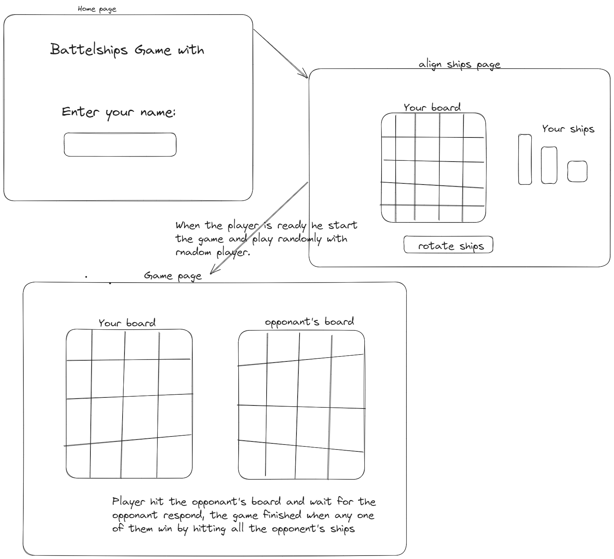

# MultiPalyer Battleships Game.

Welcome to the Multiplayer Battleships Game, a modern take on the classic naval strategy game.
This implementation allows players to compete against each other online,
challenging their tactical skills in real-time through an interactive and engaging interface.

## Game Flow

- **Create Your Player**: Enter your name to join the game as a new player.
- **Arrange Your Fleet**: Strategically place your ships on the board to prepare for battle.
- **Start the Game**: Once both players are ready, the battle begins. Take turns attacking your opponent’s board until all their ships are sunk.

## Key Features

- **Real-Time Multiplayer**: Engage with other players in real-time using Socket.io, with seamless communication between the server and clients.
- **Strategic Gameplay**: Plan your moves carefully, as you only win by sinking all your opponent's ships.
- **Responsive Design**: The game is built to be accessible across different devices, ensuring a smooth experience on both desktops and mobile devices

## Tech Stack

- `backend`:
  - TypeScript, Nodejs, Expressjs, Socket.io.
- `frontend`:
  - Typescript, React, React Router, Socket.io-client.

## To-Do

- [ ] Allow players challenge each other.
- [ ] Implement `watch mood`.
- [ ] Add chat feature between the two players